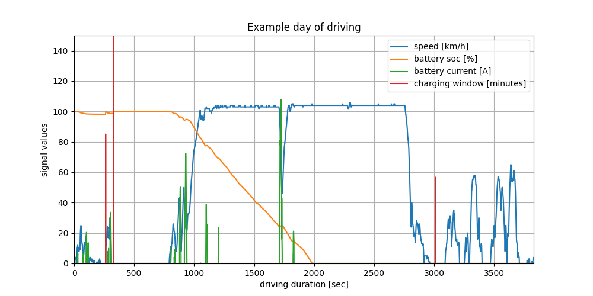

# real-world-vehicle-simulation
Modelling to understand the behaviour of a real world vehicle

This repo is an example in how would an electric vehicle behave if it were to replace a conventional vehicle  
using a sample driving trip.  
The idea is to simulate behaviours relevant to battery that are not in the data due to vehicle being a diesel powertrain. 
* Battery current
* Battery State of charge
* Effect of opportunistic charging

Such analysis can help determine the capacity of battery to that can realistically replace a conventional drivetrain.  
In addition it can help design 
* Electric machine/power electronics by understanding realistically required power limits to fulfil the driving cycle
* Charging system by understanding how much opportunistic charging is available and how to maximize it

## Interpretation
The simulation is based on a driving cycle of 1 day worth of vehicle usage. Since the vehicle can be charged overnight,  
battery SOC starts at 100% but as the day progresses, it drops with vehicle usage (ultimately to 0%).  
This is a result of choice of battery capacity (assumed 70 kWh), indicating that a much larger battery would be required to
replace a conventional vehicle that follows this usage pattern.

The simulation also shows the effect of opportunistic charging.
Opportunistic charging is charging the vehicle when it is parked and not in use. There are two effects at play here,
one is that unless the vehicle is parked for a substantial time (assumed 30 min or more), there may not be a motivation to plug the vehicle in.  
The other is that the vehicle may only be able to charge at the maximum rate of the designed charging system (assumed 8.75 kW or 8 hours to full charge).

Under such opportunistic charging and battery capacity constraints, it can be observed that charging opportunities earlier in the day
are not well utilised since the battery is almost fully charged then. But during the day depletion of battery is excessive and the
vehicle is unable to make it to the next opportunistic charging event.  
This indicates that potentially a bigger battery may be more helpful than a quicker charger to deliver required duty.

